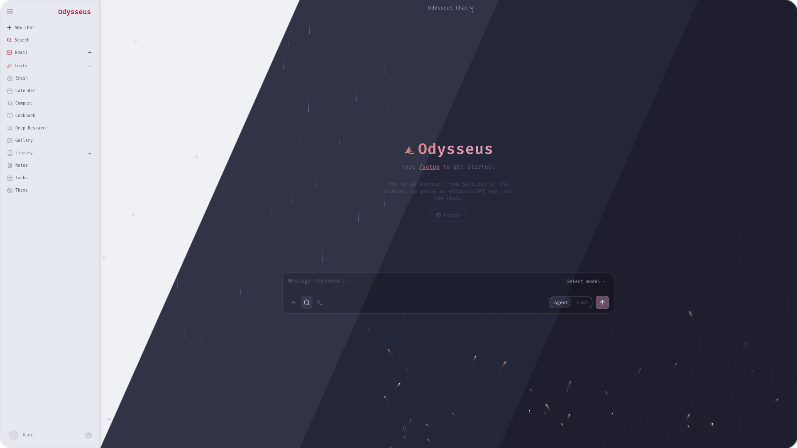
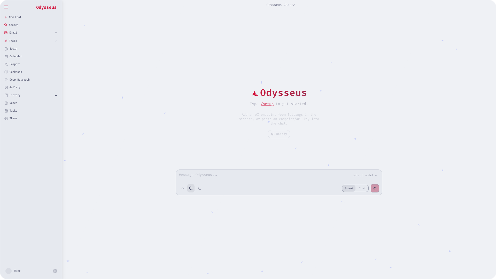
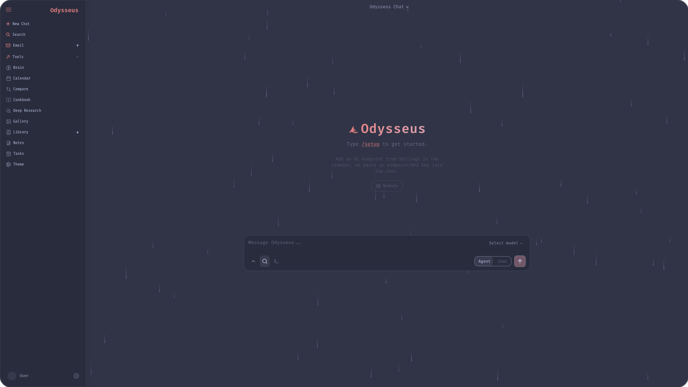
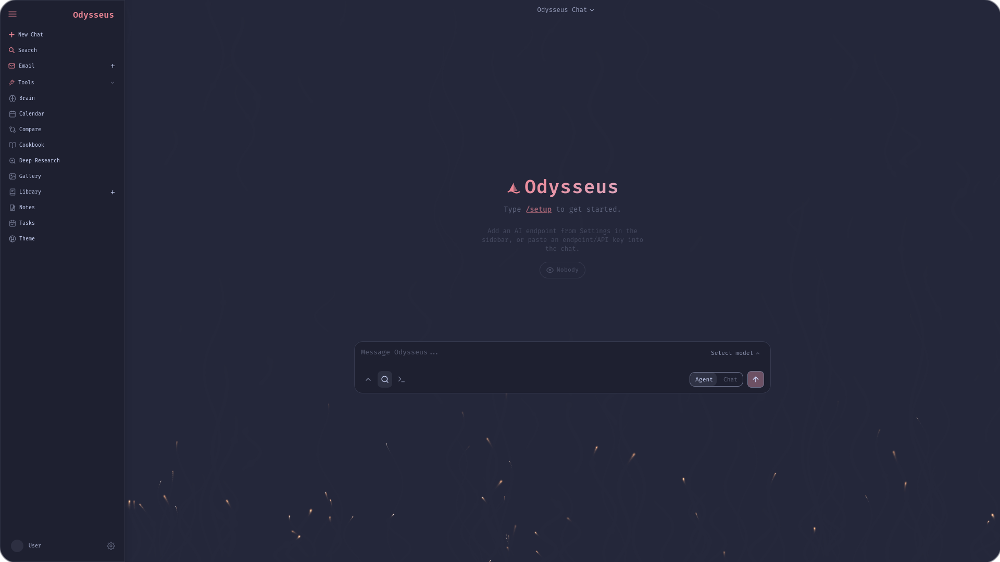
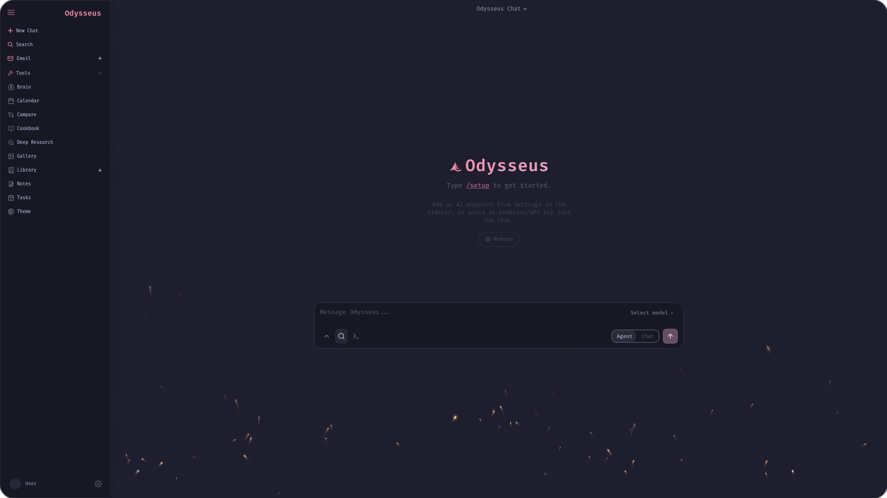

<h3 align="center">
	<br/>
	
	Catppuccin for <a href="https://github.com/pewdiepie-archdaemon/odysseus">Odysseus</a>
	
</h3>

<p align="center">
	<a href="https://github.com/Schuldkroete/catppuccin-odysseus/stargazers"></a>
	<a href="https://github.com/Schuldkroete/catppuccin-odysseus/issues"></a>
	<a href="https://github.com/Schuldkroete/catppuccin-odysseus/contributors"></a>
</p>

<p align="center">
	
</p>

## Previews

<details>
<summary>🌻 Latte</summary>

</details>
<details>
<summary>🪴 Frappé</summary>

</details>
<details>
<summary>🌺 Macchiato</summary>

</details>
<details>
<summary>🌿 Mocha</summary>

</details>

## Usage

1. Select the flavor of your choice.
2. Copy the file contents.
3. Open Odysseus and go to **Theme** > **Customize** > **Import**.
4. Paste the file file contents into the text box.
4. Click on **Apply**.

## Customization

This theme is built with [Whiskers](https://github.com/catppuccin/toolbox/tree/main/whiskers).

If you wish to change the accent color, you can override it as follows:

```console
whiskers odysseus.tera --overrides '{"accent": "mauve"}'
```

Apply the rebuilt json files as described in [Usage](#usage).

## 💝 Thanks to

- [Schuldkroete](https://github.com/Schuldkroete)

&nbsp;

<p align="center">
	
</p>

<p align="center">
	Copyright &copy; 2021-present <a href="https://github.com/catppuccin" target="_blank">Catppuccin Org</a>
</p>

<p align="center">
	<a href="https://github.com/catppuccin/catppuccin/blob/main/LICENSE"></a>
</p>
